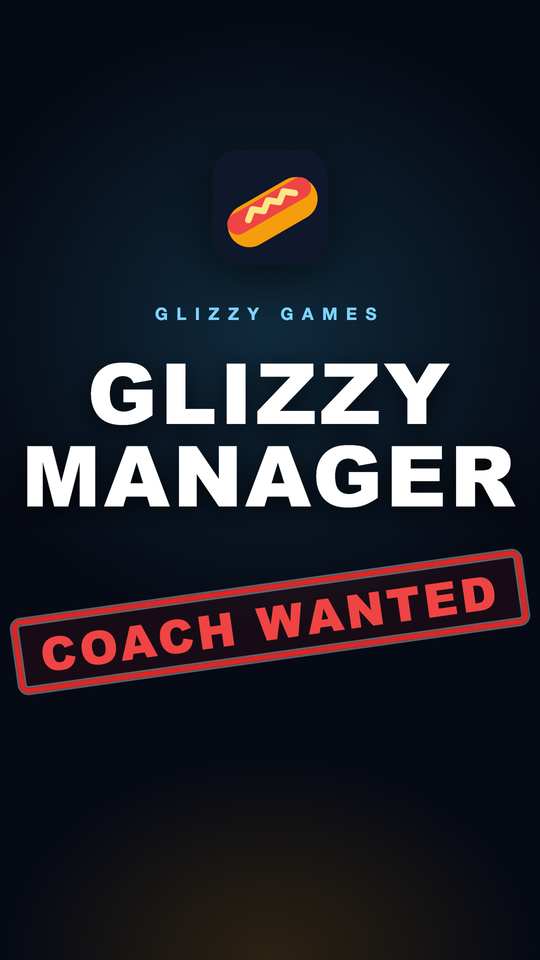
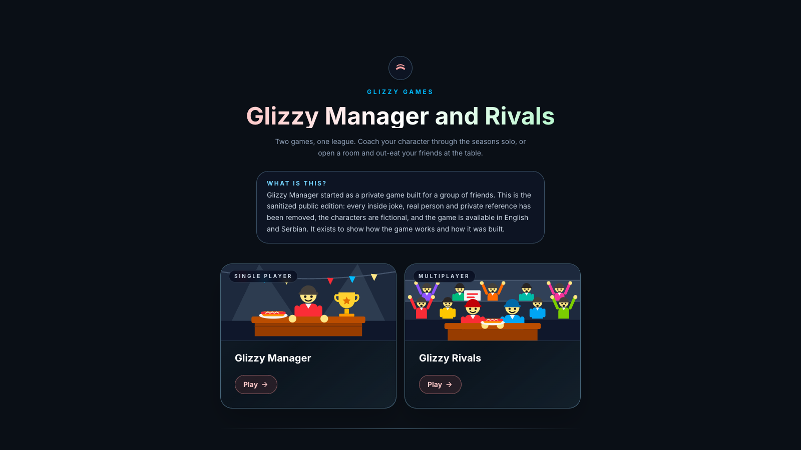
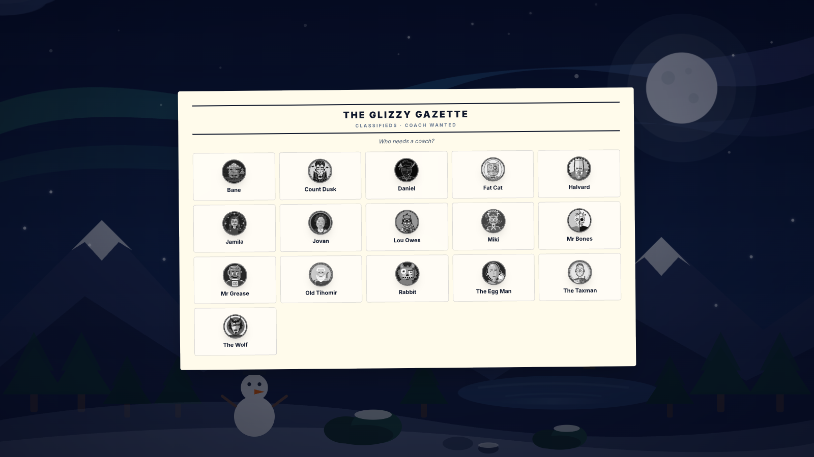
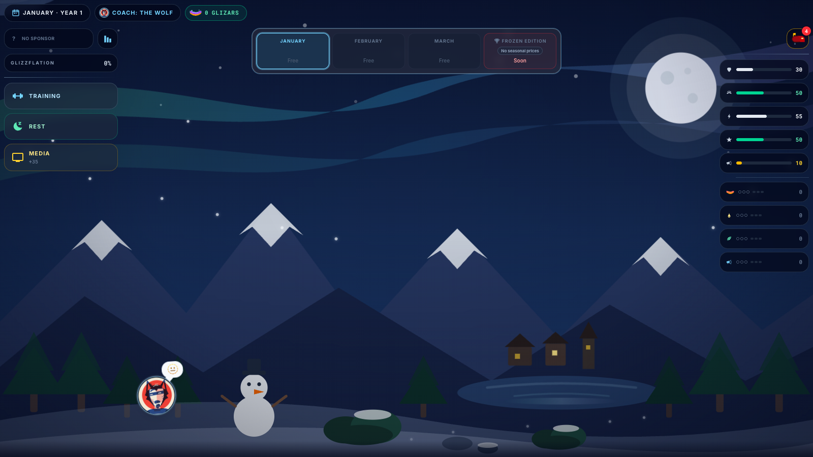
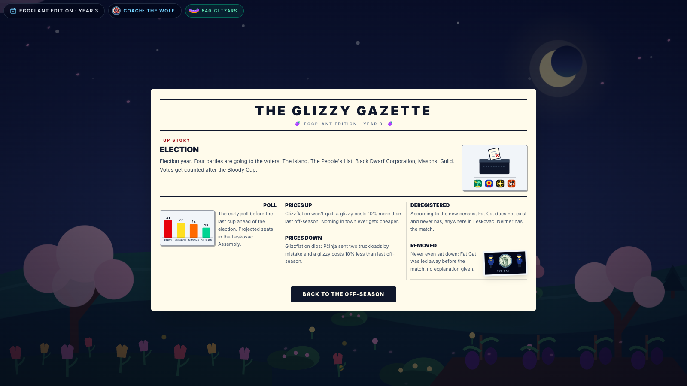
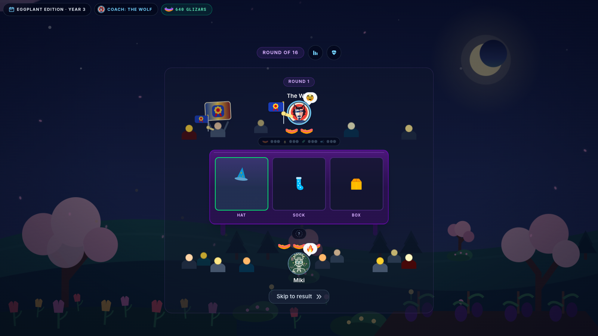
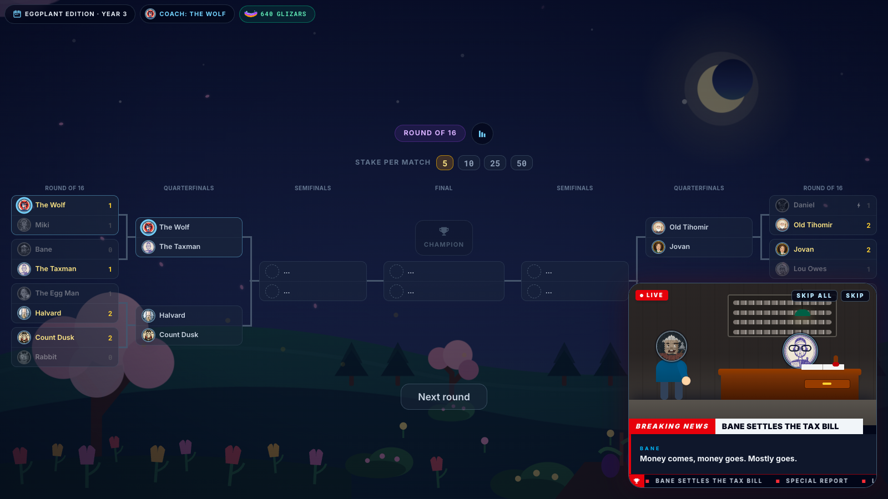
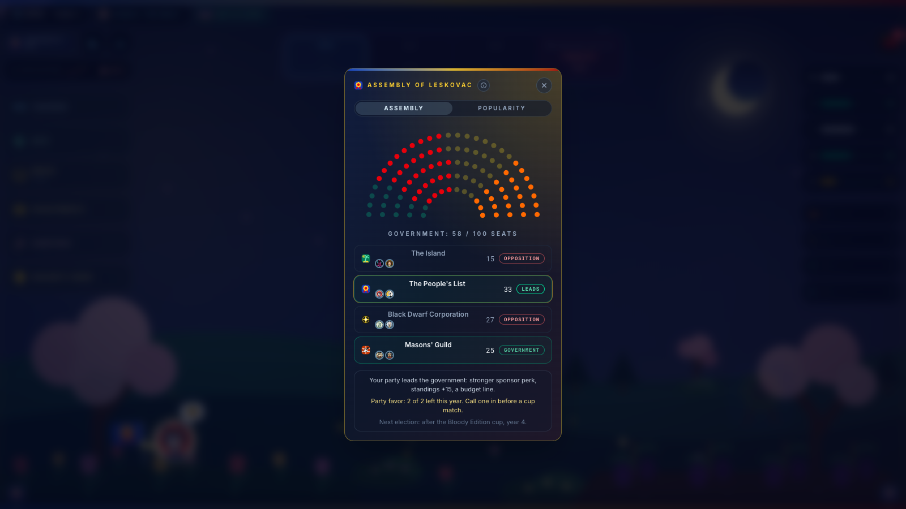
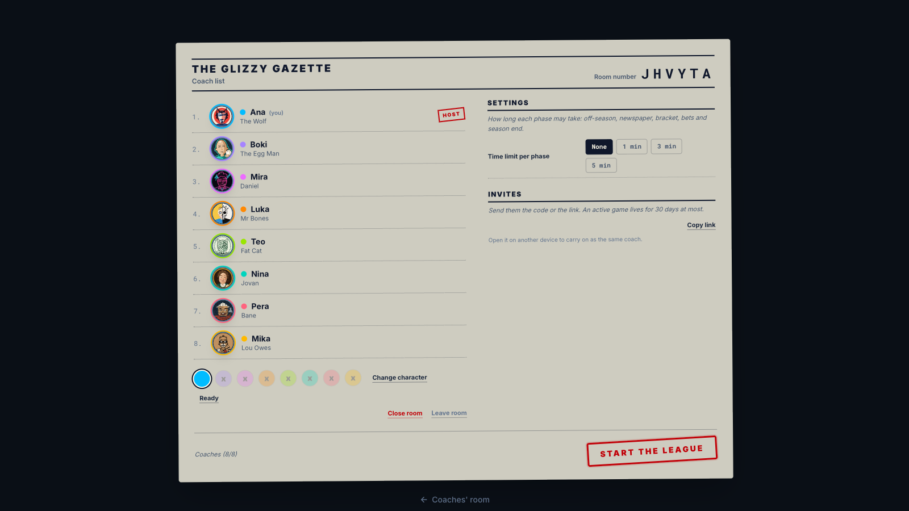

# Glizzy Manager

[](public/trailer/glizzy-manager-trailer.mp4)

**[Watch the 73-second trailer](public/trailer/glizzy-manager-trailer.mp4)** (vertical, English narration, [captions](public/trailer/glizzy-manager-trailer.vtt)).

This is a public port of a game that was made for a group of friends. The
original is full of inside jokes, real people and private references; this
edition removes all of that, swaps the private characters for fictional ones,
replaces the private material with generic content, and translates everything
to English, with Serbian kept as a second language. It is here to show how
the game was built, not to be the original.

The game itself: a management sim about a professional hot-dog eating league,
narrated like a deadpan sports broadcast. You coach one of a roster of eaters
through season after season: train them, chase cup runs, sign sponsors who
double as political parties, read the morning paper, sabotage a rival now and
then, and collect achievements along the way. Two modes share one engine:
**Glizzy Manager** is the single-player career at `/manager`, and **Glizzy
Rivals** is the same league played live in a room of up to eight coaches at
`/rivals`.

## Trailer and screenshots

The trailer at the top is regenerated with `npm run trailer:build` (see
Scripts); the game also plays it from the hub and the first onboarding step.

| | |
| --- | --- |
|  |  |
|  |  |
|  |  |
|  |  |

## What was changed for the public edition

- Every character and name is fictional.
- All text was rewritten in both languages.
- Cutscenes were made generic.
- Recordings of real people were removed; the commentator is a generated
  voice in each language, with captions.
- Art was redrawn as SVG, one style per character.
- Saves and rooms carry message keys, so both languages work on the same
  save or room.

## Quick start

```bash
npm install
npm run dev
```

The app runs at `http://localhost:3000`. Rivals rooms work locally without any
credentials (see Environment).

## Environment

Copy `.env.example` to `.env.local`.

| Variable | Purpose |
| --- | --- |
| `NEXT_PUBLIC_SITE_URL` | Public origin, used for metadata, canonical links, `robots.txt` and the sitemap. |
| `UPSTASH_REDIS_REST_URL` | Upstash Redis REST endpoint for Rivals rooms. |
| `UPSTASH_REDIS_REST_TOKEN` | Its token. |
| `CAREER_MP_UNLIMITED` | Set to `1` to lift the room creation limits during local testing. Ignored in production. |
| `XI_API_KEY` | ElevenLabs key, only for the audio generators under `scripts/`. |
| `XI_VOICE_ID` | ElevenLabs voice id for the commentary generator. |

Without the Redis variables the room store falls back to an in-memory map,
which is fine for `next dev` and wrong for serverless: a production server
started without them prints one warning and rooms vanish between instances.

## Scripts

| Script | What it does |
| --- | --- |
| `npm run dev` | Dev server. |
| `npm run build` | Production build. |
| `npm run lint` | ESLint. |
| `npm run typecheck` | `tsc --noEmit`. |
| `npm run check:locale` | `en.json` and `sr.json` share one key tree, placeholders and plural shapes. |
| `npm run check:audio` | Every clip the code can play exists under `public/games/audio`, and nothing is orphaned. |
| `npm run commentary:voices` | Shortlists ElevenLabs voices for the English commentary booth; `-- --add <public_user_id> <voice_id>` adds a shared one to the account. Needs `XI_API_KEY`. |
| `npm run commentary:render` | Renders the English commentary bank (`-- --dry-run` shows the plan and the character count). Needs `XI_API_KEY` and `XI_VOICE_ID`. |
| `npm run trailer:build` | Rebuilds the trailer under `public/trailer/` from the running dev server: renders the narration once (`XI_API_KEY`), films the game, composes and encodes. `-- --screenshots` also retakes `docs/screenshots/`. See `scripts/trailer/build.mjs`. |
| `npm run sim` | Headless Manager league simulation, 5 years x 200 runs. |
| `npm run sim:rivals` | Rivals engine smoke test, must report `"failures":0`. |

The browser and curl test kit for Rivals, with its own README, lives under
`scripts/career-mp-sim/`.

## Languages

English is the default, Serbian is the second. Every player-facing string
lives in `data/games/locales/en.json` and `data/games/locales/sr.json` under
the same key, never in a component. Add new strings to both files and run
`npm run check:locale`.

## Project layout

```
app/                    # Next.js App Router routes
  layout.tsx
  page.tsx              # hub
  manager/              # Glizzy Manager (internal name: career)
  rivals/               # Glizzy Rivals (internal name: career-mp)
  api/career-mp/        # Rivals room API
  preview/              # dev-only scene gallery, noindex
components/
  games/                # game UI, one component per file, PascalCase.tsx
  hub/                  # hub page and site header
  icons/
  preview/
  shared/               # cross-feature primitives
data/games/             # static content: roster, sponsors, seasons, commentary, locales
lib/
  constants/            # exported constants, one concern per file
  utils/                # pure helpers, grouped by concern
  queries/              # TanStack Query keys + fetchers
  server/career-mp/     # Rivals room engine
  types/                # shared TS types
public/                 # SVG portraits and marks, audio
scripts/                # simulators and generators used as checks
```

## Design notes

- Tailwind only, no custom CSS, no inline style objects. `app/globals.css`
  holds the directives, theme tokens and shared keyframes.
- Dark-first classes on the existing tokens (frost borders, slate-950/900
  backgrounds, red-300, sky-200 and cyan-200 accents, `rounded-3xl` cards);
  light mode is a palette remap in `globals.css`.
- One component per file, `PascalCase.tsx`, default export.
- Client data goes through TanStack Query; server components read the request
  locale directly.
- No em-dashes anywhere, not in UI text, Markdown or comments.

## Audio and art

All artwork is hand-written SVG, one style per character, with no raster
files under `public/`. The cutscene sound bank comes from
`scripts/career-cutscenes/generate.mjs` and the season music from the Python
scripts under `scripts/career-music/`; those mp3s are committed, so nothing
is rendered during a build. The match commentary banks for English and
Serbian under `public/games/audio/commentary/career/` are committed too,
rendered by `scripts/career-commentary/generate.mjs` (one voice per language,
model `eleven_v4`); a language without a bank shows the commentator's lines
as captions. Both `generate.mjs` scripts call ElevenLabs and need
`XI_API_KEY`, and the commentary one also `XI_VOICE_ID`. The scripts read
both from the shell, so put them in `.env.local` (gitignored) and load it with
`set -a; source .env.local; set +a`, or prefix the command with the variables.

To re-voice the English booth: `npm run commentary:voices` lists candidate
voices with preview links (a shared voice is added to the account with
`npm run commentary:voices -- --add <public_user_id> <voice_id>`), then set
`XI_VOICE_ID`, check the plan and cost with `npm run commentary:render -- --dry-run`,
render with `npm run commentary:render` (the generator skips clips that
already exist, so delete a clip to re-roll it), keep the locale in
`COMMENTARY_VOICE_LOCALES` in `lib/constants/careerCommentaryVoice.ts`, and run
`npm run check:audio`. The Serbian bank renders the same way with
`--locale sr`. The vocal takes under `scripts/career-music/vocals/` are not
included, so `scripts/career-music/vocal.py` is reference only.

## Deployment

The app is shaped for Vercel: build command `next build`, output served by
`next start` or the platform's serverless runtime.

- Set `NEXT_PUBLIC_SITE_URL` to the public origin.
- Set `UPSTASH_REDIS_REST_URL` and `UPSTASH_REDIS_REST_TOKEN`; Redis is
  required for Rivals in production (see Environment).
- Room creation is limited to 10 rooms per client address per hour and 500
  open rooms in total (`lib/constants/careerMp.ts`).
- `/preview`, `/api` and the room pages under `/rivals/` are noindexed and
  excluded in `robots.txt`; the sitemap lists `/`, `/manager` and `/rivals`.

## License

Code is MIT (keep the copyright notice in copies, which is the credit). The
characters, artwork, audio, music and text are all rights reserved. See
[LICENSE](LICENSE) for both parts.

## Credits

A few CC0 Freesound recordings are used on election night; they are credited
next to their cues in `lib/constants/cutsceneSounds.ts`.
